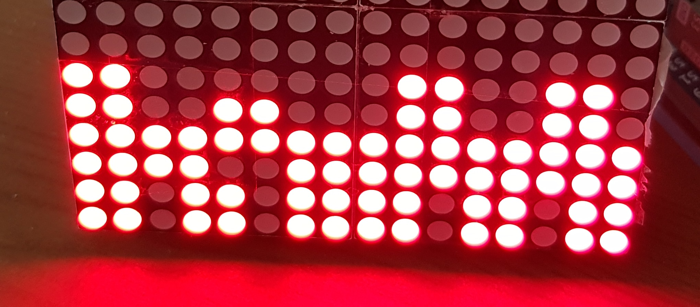

# Let's test tetris_on_due!!

To start of, you will need to build and upload this project to your arduino, this project uses the other projects for the most part.

That way you will get an board that is partly filled:

Only an small part of the board is showed on the pictures

the idea is to fill in the third and fourth line, which can be done by placing just one block:

Only an small part of the board is showed on the pictures

Make sure that **ONLY** this two lines are removed by the system, when other lines are removed you should make sure to test this a second time by using the reset button on the arduino and placing the block again.

If you are sure you have **not** created this bug youself, please create an new issue in the github repo of this project: https://github.com/Lennart99/IPASS.

I will try to fix bugs as soon as posible after they are discovered.
When the bug is in your own code, try fixing it yourself, but of course you can always ask for help.
